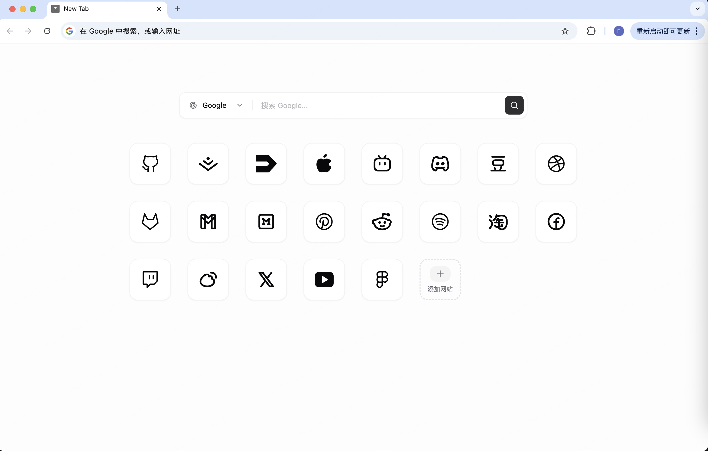

# Z-Tab

一个使用 React + shadcn/ui 构建的 Chrome 新标签页扩展。    
 
本插件纯前端开发，所有配置数据都保存在本地，未来也不打算接入接口服务。 
   
这是一个AI Vibe Coding产品，开源免费，欢迎各位标签页爱好者fork自定义创造。



## 技术栈

- ⚛️ React 18
- 🎨 Tailwind CSS
- 🧩 shadcn/ui 组件库
- 📦 Vite 构建工具
- 📝 TypeScript

## 开发

### 安装依赖

```bash
npm install
```

### 开发模式

```bash
npm run dev
```

访问 http://localhost:5173/index.html 预览页面

### 构建扩展

```bash
npm run build
```

构建产物会输出到 `dist` 目录。

## 安装扩展

1. 运行 `npm run build` 构建项目
2. 打开 Chrome 浏览器，访问 `chrome://extensions/`
3. 开启右上角的 "开发者模式"
4. 点击 "加载已解压的扩展程序"
5. 选择项目的 `dist` 目录
6. 打开新标签页，即可看到 Z-Tab 扩展页面

## 项目结构

```
z-tab/
├── src/
│   ├── components/
│   │   └── ui/          # shadcn/ui 组件
│   ├── lib/
│   │   └── utils.ts     # 工具函数
│   ├── App.tsx          # 主应用组件
│   ├── main.tsx         # 入口文件
│   └── index.css        # 全局样式
├── index.html           # 新标签页 HTML 模板
├── manifest.json        # Chrome 扩展配置
├── vite.config.ts       # Vite 配置
├── tailwind.config.js   # Tailwind 配置
└── package.json
```

## icon 仓库

- https://svgicons.com/icon-set/tabler-svg-icons
- https://www.svgrepo.com/collection/company-logo/
- https://tablericons.com/
- https://seeklogo.com/

## TODO

- [x] '2x1' 组件（时钟组件）
- [ ] '2x2' | '4x2' 尺寸组件实现
- [ ] 不同的物料组件
- [ ] 配置的导出与导入
- [ ] 本地图标全彩色化支持

## License

MIT
